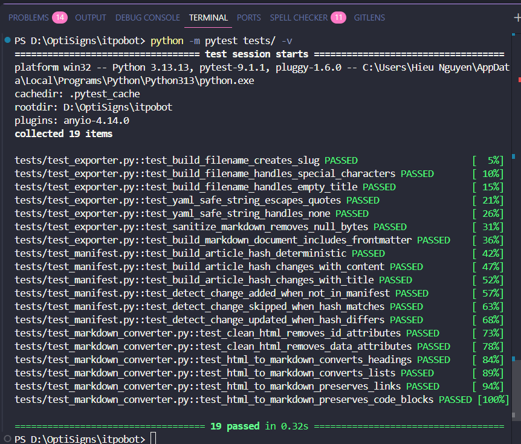
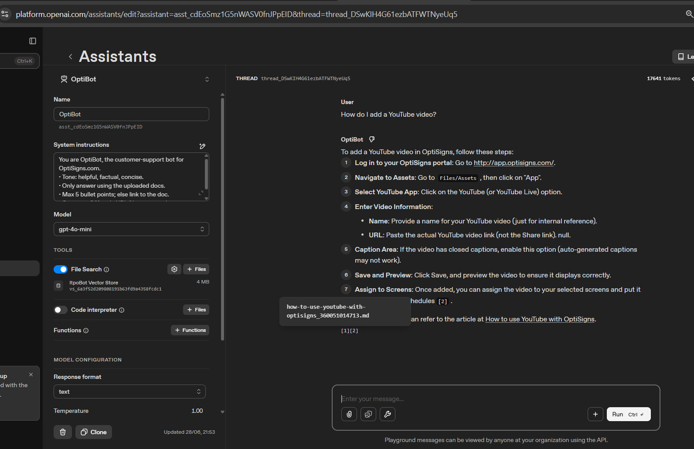

# ItpoBot

A lightweight OptiBot-style knowledge assistant built from OptiSigns Zendesk articles.

## Setup

### Prerequisites

- Python 3.13+
- OpenAI API Key

Create `.env` from the sample:

```bash
cp .env.sample .env
```

Then fill in your key:

```env
OPENAI_API_KEY=...
```

Install dependencies:

```bash
pip install -r requirements.txt
```

---

## How to Run Locally

Run the complete pipeline (scrape > detect changes > upload delta):

```bash
python main.py
```

The job will:

1. Fetch all Zendesk articles from `support.optisigns.com`
2. Convert HTML to clean Markdown
3. Detect added/updated articles via SHA-256 content hashing
4. Upload only changed files to OpenAI Vector Store
5. Update local manifest
6. Generate scrape report with counts (`added`, `updated`, `skipped`)

---

## Docker

Build:

```bash
docker build -t itpobot .
```

Run:

```bash
docker run --env-file .env itpobot
```

Or pass the key directly:

```bash
docker run -e OPENAI_API_KEY=sk-... itpobot
```

---

## Architecture

```
main.py                  # Entry point – orchestrates the full pipeline
src/
├── scraper/
│   ├── client.py        # Zendesk API client (paginated fetch)
│   ├── markdown_converter.py  # HTML -> Markdown (markdownify)
│   ├── exporter.py      # Filename slugging, frontmatter, file save
│   ├── manifest.py      # SHA-256 change detection + manifest persistence
│   └── reporter.py      # JSON scrape report generator
├── assistant/
│   ├── openai_client.py # Shared OpenAI client instance
│   ├── vector_store.py  # Create or reuse vector store
│   └── upload_files.py  # Batch upload to vector store
└── config.py            # Loads .env
storage/
├── articles/            # Scraped markdown files
├── manifests/           # Article manifest (change tracking)
├── vector_store.json    # Persisted vector store ID
└── scrape_report.json   # Last run statistics
```

---

## Change Detection Strategy

Each article is hashed using SHA-256 over `title + updated_at + body`. The hash is stored in `storage/manifests/article_manifest.json`. On subsequent runs, only articles with a new or changed hash are re-uploaded — everything else is skipped.

---

## Chunking Strategy

OpenAI Vector Store's built-in auto chunking is used. The source documents are Zendesk knowledge-base articles with clear structure (headings, sections, lists, code blocks). Auto chunking preserves context boundaries while keeping the implementation simple and maintainable.

---

## Tests

Run unit tests:

```bash
pytest tests/ -v
```



Tests cover:

- Change detection logic (SHA-256 hashing, added/updated/skipped)
- HTML -> Markdown conversion (headings, links, code blocks, attribute cleaning)
- File export (slugging, frontmatter generation, null byte sanitization)

---

## Daily Job (DigitalOcean)

The scraper runs once per day on DigitalOcean App Platform as a scheduled job.

**Job Logs:**

- [Daily Scraper Job (primary)](https://cloud.digitalocean.com/apps/facfdf5d-25ae-4a7c-bde9-b3b02010a71a/jobs/0b6e0fa7-f55b-4f73-8f2f-e7781a9eda19?i=951291)
- [Daily Scraper Job (secondary)](https://cloud.digitalocean.com/apps/facfdf5d-25ae-4a7c-bde9-b3b02010a71a/jobs/f79e7cb6-ede2-4197-a03c-a4b0bf5d61e1?i=951291)

---

## Playground Validation

Screenshot showing the assistant correctly answering a sample question with cited article URLs:


